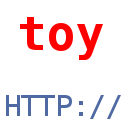

# toy-http
lightweight embeddable http service,
providing static site hosting.    
designed for unix (linux, macOSX, freebsd and other OS with posix programming environment)
# install the standalone server
You can use it as lightweight server. Only clone this repository and
type in: `./install` or if you prefer make, type `make && sudo make install`.  
Try `toy-http` to run the server in the actual directory.  
For more advanced usage you need 3 arguments in the console:  
1. Port (numeric)  
2. Max. Connections at once (numeric)  
3. Source directory (path)  
example: `toy-http 8080 300 /var/www` 

# features
- support for GET and HEAD requests
- stable error and interruption management
- embeddable as one small C function
- scalable and easy to modify
- blocking function for parental folders of the serve folder
- plainness: less than 400 lines of source code
- no dependencies to external libraries, just the C standard libraries and
 the posix API (preinstalled on all good unix-derivates)

# embed it!
You can embed it into your applications, simply add `service.h` and `service.c` to your project
and use this function: ` int serve(int http_port, int max_connections, char *serve_directory);`.  
`max_connections` is the maximum number of clients that can be connected at once.  
`serve_directory` is the folder with the ressources and files that are hosted.

# dependencies
It depends only on the std. library of C, a good C compiler and the posix programming interface.

# branches
 master    -the actual stable version  
 unstable  -development branch  

# licensing
All distributed under GNU AGPL v3 (or later); Copyright (C) 2015 Lukas Himsel
